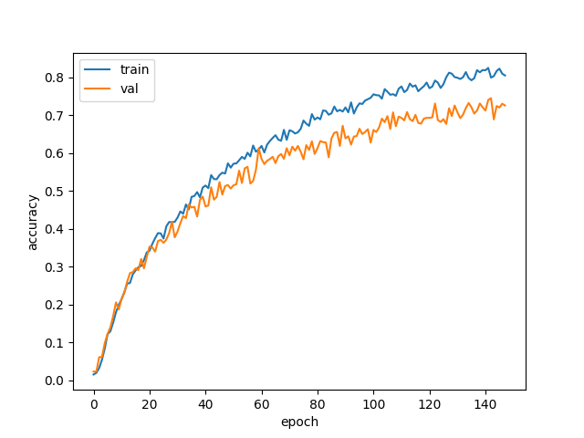

# [1인 가구를 위한 레시피 추천 노션](https://righteous-kileskus-db8.notion.site/08817662278542189d87382ec136fec5?p=729246acf0894f1980fb685d5f1a14f7&pm=c)

## 1. 프로젝트 설명
여전히 코로나로 인해 1인 가구가 많고, 늘어나는 배달 비용에 부담을 많이 느낍니다. 그런 사람들을 위해 데이터 분석을 통한 합리적인 레시피 추천 프로그램을 만들고자 합니다. 연령대와 나이, 성별부터 재료, 요리시간, 요리난이도, 요리종류까지 다양한 조건을 고려하여 1인 가구를 위한 레시피를 추천해주는 프로그램입니다. 이를 통해 비용에 대한 부담을 최소화 하는 데에 도움이 되고자 합니다.  

## 2. 프로젝트 진행 과정
> ### 데이터 수집
> https://kadx.co.kr/product/detail/0c5ec800-4fc2-11eb-8b6e-e776ccea3964  
> 농식품 빅데이터 거래소의 만개의 레시피 데이터를 활용하였습니다.

> ### 데이터 전처리
> - 레시피 데이터의 중복 및 불필요한 칼럼을 제거하였습니다.
> - 레시피의 이름만 따로 추출하여 따로 저장하였습니다
>
> https://datalab.naver.com/keyword/trendSearch.naver  
> 네이버 데이터랩에 있는 키워드 검색량 데이터를 활용하였습니다.
> - Selenium을 사용하여 레시피 검색량을 추출하였습니다.
> > 연령대별 + 성별 검색량 데이터를 추출하였습니다.  
>
> https://keywordsound.com/  
> 키워드 사운드를 활용하여 레시피의 검색량을 추출하였습니다.  
> - Selenium을 사용하여 레시피 검색량을 추출하였습니다.
> > 1년동안의 검색량 데이터를 추출하였습니다.
>
>   
> > 과도하게 크롤링을 하여 서버가 마비되었습니다.   
> 직접 사과드렸고 좋게 마무리 되었습니다.  
> 크롤링은 항상 신중하게 해야 한다는 것을 배웠습니다. 죄송합니다.
>   
> 추출한 데이터를 날짜별로 정리하였습니다.

> 기상청의 기상데이터와 공공데이터의 지역별 인구(성별, 연령대별) 데이터를 활용하였습니다.  
> 기상 데이터와 인구 데이터를 날짜별로 정리하였고, 검색량 데이터와 합쳤습니다.
### 전체적인 구조와 DB 설계는 노션을 통해 확인 가능합니다.

---- 
> ### 이미지 데이터 분석  
> - 재료 이미지 데이터를 분석하여 인식한 이미지가 어떤 재료인지 알 수 있도록 학습 예정입니다.
> - 셀레니움을 사용하여 이미지 데이터를 크롤링하였습니다.  
> 
> CNN으로 이미지를 분석하여 어떤 재료인지 알 수 있도록 학습 하였습니다.
> - 이미지 데이터를 학습시키기 위해 이미지를 전처리 하였습니다.  
    
  

```python
# ...
# Epoch 146/300
# 100/100 [==============================] - 6s 63ms/step - loss: 0.5831 - acc: 0.8233 - val_loss: 0.9350 - val_acc: 0.7207
# Epoch 147/300
# 100/100 [==============================] - 6s 62ms/step - loss: 0.5959 - acc: 0.8100 - val_loss: 0.9028 - val_acc: 0.7307
# Epoch 148/300
# 100/100 [==============================] - 6s 62ms/step - loss: 0.6300 - acc: 0.8053 - val_loss: 0.8664 - val_acc: 0.7260

# 모델 평가
print("-- Evaluate --")
scores = model.evaluate(test_generator)
print("%s: %.2f%%" %(model.metrics_names[1], scores[1]*100))
# acc: 73.29%
```

> 총 73.29%의 정확도를 보였습니다.
